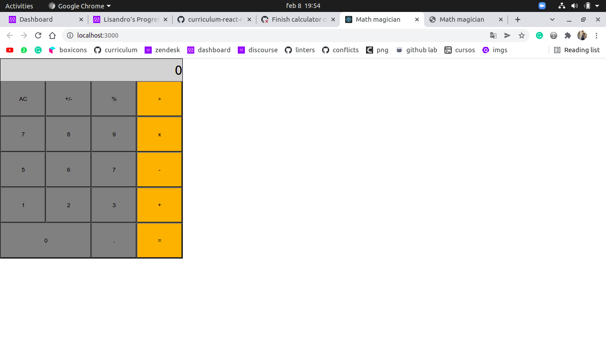

# Capstone 2

In this project I made a react component to render a calculator using hooks.

## Live demo

[heroku](https://mth-magicians.herokuapp.com/);
[netlify](https://mth-magicians.netlify.app/);

## Built With

- CSS & JavaScript
- Github, Webpack, APIs & React

## Getting Started

To get a local copy up and running follow these simple example steps.

### Setup

Clone the repo runing 'git clone https://github.com/lisandroseia/math-magicians.git'

### Install

Run 'npm install' to install all dependancies

### Usage

Run 'npm run build' to set a local copy.
Run 'npm start' to open a localhost

## Authors

👤 **Lisandro Seia**

- GitHub: [@lisandroseia](https://github.com/lisandroseia)
- LinkedIn: [LinkedIn](https://www.linkedin.com/in/lisandro-seia-295120225/)

## 🤝 Contributing

Contributions, issues, and feature requests are welcome!

Feel free to check the [issues page](https://github.com/lisandroseia/math-magicians/issues).

## Show your support

Give a ⭐️ if you like this project!

## Acknowledgments

- Hat tip to anyone whose code was used
- Inspiration
- etc

## 📝 License

This project is [MIT](https://github.com/lisandroseia/math-magicians/blob/ui/MIT.md) licensed.